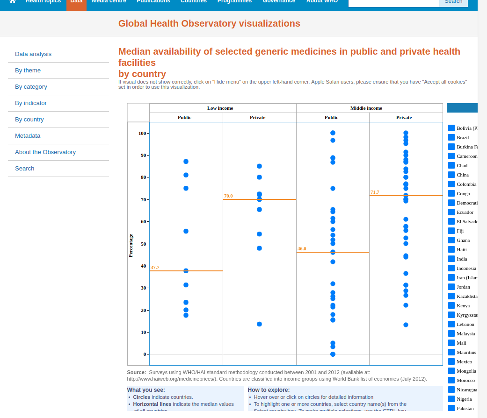

# Name: Lancaster
# Date: 10/9/2018

Question 7.

This is the data from World Health Organization's data base: http://apps.who.int/gho/data/view.main.1520_41?lang=en
The Diphtheria Reported cases by WHO region from 1980 to 2017.
We can clearly see that for the global data in 1980, the number of reported cases is 97511. By 2017, it becomes 16435.  
Since this is the data from World Health Organization, it is unlikely to be the incorrect data, and it make sense for vaccines to be effective on the disease during 37 years. Hence I trust the data I found.

Question 8.

1. "After Dr. Wakefield’s study, vaccination rates plunged in Britain and the number of measles cases soared." The incorrect research report like this will let parents don't trust the vaccines anymore, and people stop taking the vaccines which will be beneficial for them. As the results, more people get the disease which they wouldn't if they took the vaccine.

2. The academic research groups and organizations should have more self-control to make sure they are not publishing incorrect articles for their own benefits. Besides that, they need to provide more transparency to the public or to each other, so people can check and make sure it is absolutely correct before it is commonly accepted as a fact.

3. It would not fix all the damage, because there are some people may still not have chance to hear this news, so they may still believe the wrong thing. The distrust of the public medicine can not be easily fixed. Besides trying to let more people know the fact that MMR are autism are not related to each other, there isn't too much we can do, because it takes time to fix. The more important is to avoid the similar mistake happen in future.

Question 9.

These are the data for Median availability of selected generic medicines Data by country.
I found it on World Health Organization's data base: http://apps.who.int/gho/data/node.main.488?lang=en
It can be used in a project to determine whether vaccines are beneficial when we analysis the cost of vaccines.
It is important because if the price of the vaccines are too high, some times it is not worthy for its quality.
When people can not buy it because it is too expensive, and thinking about buying generic medicines, it is not beneficial.

These are the Measles, 1st dose (MCV1) Immunization coverage estimates by country from 1980 to 2017.
I found it on World Health Organization's data base: http://apps.who.int/gho/data/node.main.A826?lang=en
It shows how long will it take to increase the Immunization coverage in each country.
To determine whether vaccines are beneficial, we need to know how soon will it benefit a country in general.
If for some reasons, it takes so many years to increase the coverage, it is not beneficial for the country.

Question 10.

The professors first talked about data analytic is very important in Global Health field.
People who work in this field are using data to fight disease and to track out-breaks of serious ailments in diverse communities all over the world.
However, unlike our class, they are using SAS, SPSS instead of R.
They also mentioned that when we are using data to analysis, we probably need Code books, Data dictionaries, Metadata and Re-code files.
Some times the code may get too complicated, but we can use Google to learn and search how to use those tools.
They also mentioned that sampling is important. Usually people use random sampling, but for health they don't use the random sampling. To avoid the over Sampling.
There are some specific techniques for them, such as Global school based student health Survey.
Then they differentiate and compared Local----Global, Micro----Aggregated.
Data sharing VS. Data protecting is still the big topic and having conflict.
There are huge different norms between social science and nature science.
Social science are not too serious about data because other people can easily know that if they also make a survey.
Nature science are more serious and they usually protect their data well.
Then they mentioned more techniques of data analytic: Study Design, Research Methods.
The most important is to find the artistic creative process of how to put all different data together.(merge data)
How to make the conclusion of the data/ facts. What caused something? Identification strategy.
They then talked about the data overuse -- it is easy to make mistakes -- there was a hardworking student group didn't realize their mistake until the last second, and use data to fight disease may take long time, may be more than 20 years, so a small mistake may hurt a lot.
Then they introduced some good data source:
Global:
World Health Organization
Demographic + Health Surveys
CDC-NCHS
The World Bank
-LSMS -ISA
Harvest Choice
Good + Ag Organization (FAO)
US:
EPA
USDA
At the end of the speech, they gave us their email: rdawson@allegheny.edu, afinaret@allegheny.edu
